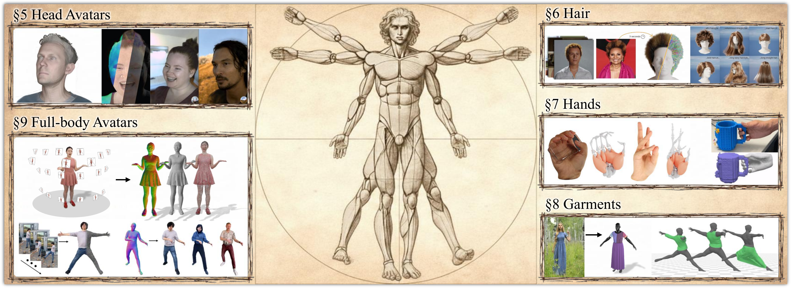

<h2 align="center"><b>How to Build Digital Humans? From Priors to Photorealistic Avatars</b></h2>

<h4 align="center"><b>
    <a href="https://zielon.github.io/">Wojciech Zielonka</a><sup>1†</sup>,
    <a href="https://tobias-kirschstein.github.io/">Tobias Kirschstein</a><sup>2†</sup>,
    <a href="https://sites.google.com/site/bolkartt/">Timo Bolkart</a><sup>3†</sup>,
    <br>
    <a href="https://simongiebenhain.github.io/">Simon Giebenhain</a><sup>2</sup>,
    <a href="https://vanessik.github.io/">Vanessa Sklyarova</a><sup>5,8</sup>,
    <a href="https://scholar.google.com/citations?hl=zh-CN&user=X0U6Yj0zg7gC">Xiang Deng</a><sup>4</sup>,
    <br>
    <a href="https://xiangdonglai.github.io/">Donglai Xiang</a><sup>6</sup>,
    <a href="https://shunsukesaito.github.io/">Shunsuke Saito</a><sup>1</sup>,
    <a href="https://liuyebin.com/">Yebin Liu</a><sup>4</sup>,
    <a href="https://niessnerlab.org/">Matthias Niessner</a><sup>2</sup>,
    <a href="https://justusthies.github.io/">Justus Thies</a><sup>7†</sup>
</b></h4>

<h6 align="center">
    <sup>1</sup><i>Meta</i> &nbsp;
    <sup>2</sup><i>Technical University of Munich</i> &nbsp;
    <sup>3</sup><i>Google</i> &nbsp;
    <sup>4</sup><i>Tsinghua University</i><br>
    <sup>5</sup><i>Max Planck Institute for Intelligent Systems</i> &nbsp;
    <sup>6</sup><i>NVIDIA</i> &nbsp;
    <sup>7</sup><i>Technical University of Darmstadt</i> &nbsp;
    <sup>8</sup><i>ETH Zurich</i>
</h6>

<h6 align="center"><i>† Equal contribution</i></h6>

<h5 align="center"><i>Computer Graphics Forum, Vol. 45, No. 2, 2026 (Eurographics State-of-the-Art Report)</i></h5>

<h4 align="center">
<a href="https://zielon.github.io/how-to-build-digital-humans/" target="_blank">🌐 Website&nbsp</a>
<a href="https://arxiv.org/" target="_blank">📄 Paper&nbsp</a>
<a href="https://www.youtube.com/watch?v=placeholder" target="_blank">📺 Video&nbsp</a>
</h4>

<div align="center">

<br>
<i>Building digital avatars requires considering many components — head, hair, hands, garments, and full body — each with distinct challenges across different creation stages. The background image was generated using Google Gemini.</i>
</div>
<br>

## Abstract

This state-of-the-art report provides an overview of controllable 3D human avatar creation. We describe current 3D avatar systems, which typically consist of three stages: (i) learning priors of human appearance and motion, (ii) creating a personalized avatar, and (iii) animating the avatar. To limit the scope, we focus on the prior learning and avatar creation stages. We define current avatar representations and introduce a taxonomy that categorizes existing work along multiple axes, including body regions and employed priors. We review methods for full-body and head avatars, as well as layered representations that decompose the body into components such as hands, hair, and garments. Finally, we outline common underlying principles, reference key literature for newcomers, and discuss open challenges and future research directions.

## Quick start

### Prerequisites

- Python 3.10+ with `pandas`, `requests`, `pdf2image`, `Pillow`
- `poppler` (for PDF thumbnail extraction): `brew install poppler`

### Full build

```bash
./deploy.sh
```

This runs all steps:
1. Fetches PDF thumbnails from arXiv (slow on first run, ~250 papers)
2. Fetches paper abstracts from arXiv API
3. Builds taxonomy, assets, datasets, and legend HTML tables from CSVs
4. Generates corresponding LaTeX tables (taxonomy.tex, assets.tex, datasets.tex, legend.tex)
5. Builds publications HTML from bibliography.bib
6. Updates the cache-busting version in index.html

### Local development with auto-rebuild

```bash
./serve.sh
```

Starts a local server at `http://localhost:8000` and watches `tables_src/`, `assets/`, `templates/`, `scripts/`, and `tables/` for changes. On any file save, tables are automatically rebuilt and the cache version is bumped. Just refresh the browser.

Custom port: `./serve.sh 3000`

### Running tests

```bash
./test.sh
```

Runs the full test suite with verbose output. You can pass extra pytest flags:

```bash
./test.sh -k venue          # run only venue-related tests
./test.sh tests/test_publications.py   # run a specific test file
```

Tests are also run automatically in CI on every push and pull request to `main`.

## Contributing a paper

Papers can be added via the **Add entry** tab on the [website](https://zielon.github.io/how-to-build-digital-humans/).

1. Fill in the form and click **"Add to dataset"**
2. Download the updated `publications.json` or the `.patch` file
3. Fork the repository and open a Pull Request

A CI check will automatically validate your entry (schema, venues, links, duplicates) and post the results as a PR comment. After merging, maintainers run `./deploy.sh` to fetch thumbnails, abstracts, and rebuild the site.

## Project structure

```
index.html                  Main page (title, authors, teaser, abstract, tables)
assets/
  css/style.css             All styling
  js/app.js                 Tab switching & cache busting
  js/bib-popup.js           BibTeX popup modal
  img/teaser.png            Teaser figure
  img/icons/                Icon assets for taxonomy tables
  img/thumbnails/           PDF first-page thumbnails (auto-generated)
  data/publications.json    Consolidated publication data
tables/                     Generated HTML snippets (do not edit directly)
  taxonomy.html             Avatar taxonomy table
  assets.html               Assets taxonomy table
  datasets.html             Datasets table
  legend.html               Legend / icon key
  publications.html         Publication cards
  add-entry.html            Community contribution form
tables_src/                 Source data & build scripts
  bibliography.bib          Main bibliography (synced from Overleaf)
  build_tables.py           Generates taxonomy/assets/datasets/legend HTML + LaTeX
  build_publications.py     Generates publications HTML + JSON
  table.py                  Shared config (legend mapping, column config, LaTeX output)
  normalize_fields.py       CSV field normalization utilities
  fetch_abstracts.py        Fetches paper abstracts from arXiv API
  macros.tex                LaTeX macro definitions (icon/crbox mappings)
  legend.tex                LaTeX legend table source
  papers.txt                Avatar paper ordering by body-part section
  assets.txt                Assets paper ordering by body-part section
scripts/
  fetch_thumbnails.py       Downloads PDFs & extracts first-page thumbnails
  validate_new_entries.py   PR validation for new publication entries
  check_assets.py           Checks for missing thumbnails and abstracts
tests/                      Validation tests (CSV schema, publications pipeline)
```

## Deploying on GitHub Pages

Push to `main` branch. The GitHub Actions workflow (`.github/workflows/deploy.yml`) automatically builds and deploys to GitHub Pages.

### Citation
If you find this work useful, please cite:
```bibtex
@article{zielonka2026star,
  author    = {Zielonka, Wojciech and Kirschstein, Tobias and Bolkart, Timo and Giebenhain, Simon and Sklyarova, Vanessa and Deng, Xiang and Xiang, Donglai and Saito, Shunsuke and Liu, Yebin and Nie{\ss}ner, Matthias and Thies, Justus},
  title     = {How to Build Digital Humans? From Priors to Photorealistic Avatars},
  journal   = {Computer Graphics Forum (Eurographics State-of-the-Art Report)},
  volume    = {45},
  number    = {2},
  year      = {2026},
}
```
